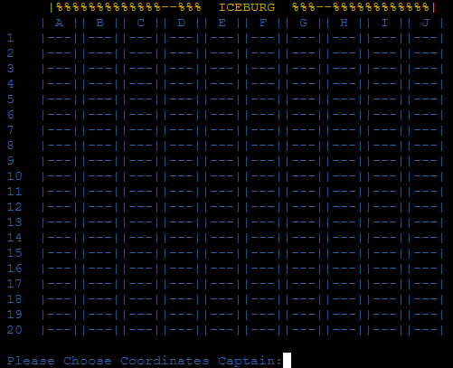
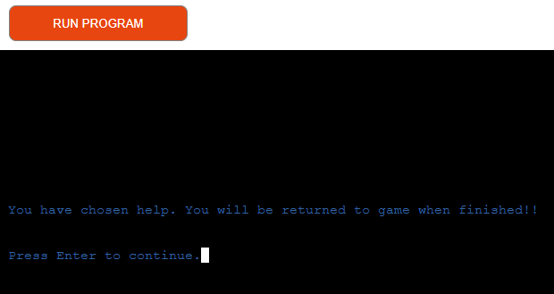
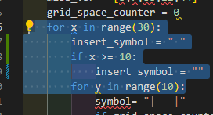

# Creator: Paul Gleeson

# Iceberg

&nbsp;

# Introduction

### Iceberg is a game of cunning and guile for one player, with an estimated play time of 15 minutes. The object of the game is to destroy 3 Icebergs to clear a path for your ship to cross. The game is controlled by inputting coordinates to smash 3 virtual hidden Icebergs. 

## README Table Content

1.  [Introduction](#Introduction)
    1.  [Project Goals](#Project-Goals)
    2.  [User Experience](#User-experience)
    3.  [Target Audience](#Target-Audience)

2.  [How to Play Iceberg](#How-to-play-Iceberge)
    1.  [The Game Board](#The-Game-Board)
    2.  [Method](#Method)

3.  [Help File](#Help-File)
    1. [Page One](#page-one)
    1. [Page Two](#page-Two)
    1. [Page Three](#page-Three)
    1. [Page Four](#page-Four)

4.  [Error Catching](#error-catching)
    1.  [Error catch 1. (Help function)](#error-catch-1-help-function)
    2.  [Error catch 2. (End_Game function) ](#error-catch-2-end_game-function)
    3.  [Error catch 3. (Check for Blank) ](#error-catch-3-check-for-blank)
    4.  [Uppercase 4. (Check if Upper Case)](#uppercase-check-if-upper-case)
    5.  [Error catch 5. (Check if range A to J)](#error-catch-5-check-if-range-a-to-j)
    6.  [Error catch 6. (Check for 4 Char) ](#error-catch-6-check-for-4-char)
    7.  [Error catch 7. (Check for Colon)](#error-catch-7-check-for-colon)
    8.  [Error catch 8. (Check 3rd input Number)](#error-catch-8-check-3rd-input-number)
    9.  [Error catch 9. (Check range number is 0 to 2)](#error-catch-9-check-range-number-is-0-to-2)
    10. [Error catch 10. (If input 3 is = 2, input 4 must be a 0) ](#error-catch-10-if-input-3-is--2-input-4-must-be-a-0)
    11. [Error catch 11. (Check input 4 is a number)](#error-catch-11-check-input-4-is-a-number)
    12. [ Error catch 12. (Check for duplicates)](#error-catch-12-check-for-duplicates)

3.  [Testing](#testing)
    1. [Manual Testing](#manual-testing)
    2. [Cell Functionality](#cell-functionality)
    3. [Input Testing](#input-testing)
    4. [PEP8 Validation](#pep8-validation)
4.  [Bugs](#bugs-and-fixes)
    1. [DRY](#dry)

## Project Goals

* Create a game using Python, that takes input data from the user and manipulate the data to present a game that’s both interesting and enjoyable.
* Create a help file that display in clear and precise instructions on how to play.
* Catch all input errors and report to user.

## User experience

* Create an atmosphere using creative writing that that embeds the user to the task.
* Create a game that gives instant and clear feed back to the user during the game.
* Create a game that track and reports all errors with feedback to the user.
* Create a game that challenging against a computer opponent.
* Accept upper and lower case input for letters in coordinates to speed up user experience. 
* Add help function to game so user can recall help at any time.
* Add quit game function so user can quit game if so desired.

## Target Audience
- Younger and older users who like playing games.
- Older users who want to retain their conative abilities in later years. 
- People who want to play a 15 min game waiting for an appointment. 

# How to play Iceberg
## Game creative writing introduction

### Hello and welcome to Iceberg, a game of cunning and guile. The object of the game is to destroy 3 Icebergs to clear a path for your ship to cross, but! Its fogy and you cannot see, fortunately the sea is flat as a pancake and you can hear the sound of dripping water as the icebergs melt, 'It’s so quiet' you hear - the first mate say, 'it’s so quiet'.
&nbsp;
### Use this tranquillity to your advantage, your crew will listen out for the sound of ice crushing under the weight your torpedoes as you hunt in the fog for the "ICEBERGS".
&nbsp;  
     

## The Game board

### The game board consists of 200 squares, top row A to J and side column of 01 to 20. The user is prompted to input coordinates at the bottom of page.  

<figure>

</figure>

## Method
### You can achieve your goal by selecting Coordinates to launch your torpedoes into the foggy night. Firstly select a letter from the top row of A to J. Then insert a colon: to separate letters from numbers. After the colon you can select a number from 01 to 20.
&nbsp; 
### "  Please note the input must be 4 char long." 
&nbsp; 
### An example of this would be B:02, for Column b row 2. If you choose a row number less than 10 it must be preceded with a 0. An example of this for Column h row 2, would be H:02.

<figure>

</figure>
        
    
### Iceburgs are huge and 90% is hidden underwater, so you will need hit it dead centre to destroy the Iceberg.
### Thus you may hit outside of the Iceberg before you can hit its center.

### The computer will display a 0 if its a miss as below. 

<figure>

</figure>

### If you clip the outside of the Iceberg the computer will display a 1. 
<figure>

</figure>

### You will also recieve a message from the crew that you have cliped an Iceberg and tthat its a near hit.

<figure>

</figure>

### Icebergs take up 9 spaces, X in middle, surounded by 1's 

<figure>

</figure>

### The game will reveal the complete iceberg if you smash its center.

<figure>

</figure>

### The game is over when you sink all 3 Icebergs or quit game by typing end_game at the command prompt. If the user needs to see the rules again they can input 'help' to the command prompt. 
&nbsp; 
###                     
Good luck captain and God Speed! 
 
&nbsp;

# Help File

## Page one
### On launching the help file is displayed 
### Page one sets the event with some creative writing and immerses the user in the story, setting the scenario and drawing the user into the game.

<figure>

</figure>

## Page two

### Page two of the help file gives clear instructions on how to play the game and how to enter Coordinates, stating that the first letter is not case sensitive. 

<figure>

</figure>

## Page three

### Page three explains the damage system to the user, detailing what happens with misses, near hits, direct hits and how to win the game. 

<figure>

</figure>

## Page four

### Page four explains that if you smash the center of the Iceberg it will reveal the surounding targets so the user doenent get confused with other Icebergs. The page clearly explains how to Win or how to Lose. 

<figure>

</figure>

# Error Catching

### A great deal of the project has been devoted to error catching from the user input. This is a complex procedure attempting to catch all input from the user, checking the input is valid.

## Error catch 1. (Help function)
### Error catch 1, will watch for user input and compair it to 'help' function. This will display a message informing the user that they will be brought to the help file and then returned to the game. 

<figure>

</figure>

## Error catch 2. (End_Game function) 

### Error catch 2, will watch for user input and compare it to 'end_game' function. This will display a message informing the user that they will end the game. “You lose” is purposely not included in the message as this would be a negative statement to the user. “Please come back soon” was enabled for a more positive feedback experience.

<figure>

</figure>

## Error catch 3. (Check for Blank) 

### Error catch 3, checks if the first input by the user blank or no input. If so the computer will display and error to the user asking them to try again. 

<figure>

</figure>

## Uppercase. (Check if Upper Case)

### Next the computer will check if the input is upper case and then transpose it to lower case. 

<figure>

</figure>

## Error catch 4. (Is first a Letter) 

### Error catch 4, checks if the first input by the user is a letter. If this is not a letter the computer will display and error to the user asking them to try again. 

<figure>

</figure>

## Error catch 5. (Check if range A to J)

### Error catch 5, checks if the first input by the user is a letter between A and J. If this is not a letter between A and J the computer will display and error to the user asking them to try again. 
### The program allows for upper and lower case.

<figure>

</figure>

## Error catch 6. (Check for 4 Char) 

### Error catch 6, checks that the user has input four characters to the coordinates prompt. The computer will display their input and error to the user asking them to try again.

<figure>

</figure>

## Error catch 7. (Check for Colon)

### Error catch 7, checks the second input and compares it to a : colon, if it is not, the user receives an error message.  
<figure>

</figure>

## Error catch 8. (Check 3rd input Number)

### Error catch 8, checks the third input is a number, if it is not, the user receives an error message stating that it must be 0, 1, or 2. This is because there are only 200 grids in the game map.   
<figure>

</figure>

## Error catch 9. (Check range number is 0 to 2) 

### Error catch 9, checks the third is a 0, 1 or 2 , if it is not, the user receives an error message stating that it must be 0, 1, or 2. This is because there are only 200 grids in the game map.   
<figure>

</figure>

## Error catch 10. (If input 3 is = 2, input 4 must be a 0) 

### Error catch 10, checks if third digit is 2 that the fourth digit has to be a 0, if it is not, the user receives an error message that if the 3rd digit is a 2 then the second must be a 0. This is because there are only 200 grids in the game map.   
<figure>

</figure>

## Error catch 11. (Check input 4 is a number)

### Error catch 11, checks if the forth input is a number, if it is not, the user receives an error message showing what they input and displaying an error message that the 4th input is not a number and please try again. .   
<figure>

</figure>

## Error catch 12. (Check for duplicates)

### Error catch 12, checks if the if the user has already input there coordinates and if so the user receives an error message showing what they input there coordinates before and please try again. .   

<figure>

</figure>

# Testing

## Manual Testing

### Cell Functionality 

| Test Item          | Method |  Input details | Desired Result                          | Result     | Pass |
| ------------------ | ------ | -------------- | --------------------------------------- | ---------- | ---- |
| Command Line Input | Input  |      A:01      | The corresponding cell will display a 0 | As desired | Yes  |
| Command Line Input | Input  |      B:01      | The corresponding cell will display a 0 | As desired | Yes  |
| Command Line Input | Input  |      C:01      | The corresponding cell will display a 0 | As desired | Yes  |
| Command Line Input | Input  |      D:01      | The corresponding cell will display a 0 | As desired | Yes  |
| Command Line Input | Input  |      E:01      | The corresponding cell will display a 0 | As desired | Yes  |
| Command Line Input | Input  |      F:01      | The corresponding cell will display a 0 | As desired | Yes  |
| Command Line Input | Input  |      G:01      | The corresponding cell will display a 0 | As desired | Yes  |
| Command Line Input | Input  |      H:01      | The corresponding cell will display a 0 | As desired | Yes  |
| Command Line Input | Input  |      I:01      | The corresponding cell will display a 0 | As desired | Yes  |
| Command Line Input | Input  |      J:01      | The corresponding cell will display a 0 | As desired | Yes  |
| Command Line Input | Input  |      A:02      | The corresponding cell will display a 0 | As desired | Yes  |
| Command Line Input | Input  |      B:02      | The corresponding cell will display a 0 | As desired | Yes  |

### All 200 cells were tested for functionality, from A:01 to J:20 with no errors.

# Input Testing

### Random changing of letters and numbers plus
### All these symbols wer tested as first char # ! @ # & ( ) – 
### [ { } ] : ; ', ? / * and symbol characters ` ~ $ ^ + = < > “

| Test Item          | Method |  Input details | Desired Result                          | Result     | Pass |
| ------------------ | ------ | -------------- | --------------------------------------- | ---------- | ---- |
| Command Line Input | Input  |      5:01      | Error message displayed                 | As desired | Yes  |
| Command Line Input | Input  |      z:01      | Error message displayed                 | As desired | Yes  |
| Command Line Input | Input  |      p:01      | Error message displayed                 | As desired | Yes  |
| Command Line Input | Input  |      =:01      | Error message displayed                 | As desired | Yes  |
| Command Line Input | Input  |      #:01      | Error message displayed                 | As desired | Yes  |
| Command Line Input | Input  |      +:01      | Error message displayed                 | As desired | Yes  |
| Command Line Input | Input  |      `:01      | Error message displayed                 | As desired | Yes  |
| Command Line Input | Input  |      *:01      | Error message displayed                 | As desired | Yes  |

### Random changing of letters and numbers plus
### All these symbols were tested as second char # ! @ # & ( ) – 
### [ { } ] : ; ', ? / * and symbol characters ` ~ $ ^ + = < > “

| Test Item          | Method |  Input details | Desired Result                          | Result     | Pass |
| ------------------ | ------ | -------------- | --------------------------------------- | ---------- | ---- |
| Command Line Input | Input  |      A;01      | Error message displayed                 | As desired | Yes  |
| Command Line Input | Input  |      A@01      | Error message displayed                 | As desired | Yes  |
| Command Line Input | Input  |      A+01      | Error message displayed                 | As desired | Yes  |
| Command Line Input | Input  |      A401      | Error message displayed                 | As desired | Yes  |
| Command Line Input | Input  |      A-01      | Error message displayed                 | As desired | Yes  |
| Command Line Input | Input  |      A¬01      | Error message displayed                 | As desired | Yes  |
| Command Line Input | Input  |      A>01      | Error message displayed                 | As desired | Yes  |
| Command Line Input | Input  |      A=01      | Error message displayed                 | As desired | Yes  |

### Random changing of letters and numbers plus
### All these symbols wer tested as third char # ! @ # & ( ) – 
### [ { } ] : ; ', ? / * and symbol characters ` ~ $ ^ + = < > “ 

| Test Item          | Method |  Input details | Desired Result                          | Result     | Pass |
| ------------------ | ------ | -------------- | --------------------------------------- | ---------- | ---- |
| Command Line Input | Input  |      A:;4      | Error message displayed                 | As desired | Yes  |
| Command Line Input | Input  |      B:@1      | Error message displayed                 | As desired | Yes  |
| Command Line Input | Input  |      A:+1      | Error message displayed                 | As desired | Yes  |
| Command Line Input | Input  |      A:"1      | Error message displayed                 | As desired | Yes  |
| Command Line Input | Input  |      A:=6      | Error message displayed                 | As desired | Yes  |
| Command Line Input | Input  |      A:>1      | Error message displayed                 | As desired | Yes  |
| Command Line Input | Input  |      A:~8      | Error message displayed                 | As desired | Yes  |
| Command Line Input | Input  |      A:?1      | Error message displayed                 | As desired | Yes  |

### Random changing of letters and numbers plus
### All these symbols wer tested as fourth char # ! @ # & ( ) – 
### [ { } ] : ; ', ? / * and symbol characters ` ~ $ ^ + = < > “ 

| Test Item          | Method |  Input details | Desired Result                          | Result     | Pass |
| ------------------ | ------ | -------------- | --------------------------------------- | ---------- | ---- |
| Command Line Input | Input  |      A:1#      | Error message displayed                 | As desired | Yes  |
| Command Line Input | Input  |      B:1~      | Error message displayed                 | As desired | Yes  |
| Command Line Input | Input  |      A:1"      | Error message displayed                 | As desired | Yes  |
| Command Line Input | Input  |      A:2£      | Error message displayed                 | As desired | Yes  |
| Command Line Input | Input  |      A:0$      | Error message displayed                 | As desired | Yes  |
| Command Line Input | Input  |      A:2^      | Error message displayed                 | As desired | Yes  |
| Command Line Input | Input  |      A:1!      | Error message displayed                 | As desired | Yes  |
| Command Line Input | Input  |      A:00      | No                                      | nothing    | no   |

### The error above was fixed by adding code to catch a double 00 input. 

### Random changing of letters and numbers plus
### All these symbols wer tested as end_game and help char # ! @ # & ( ) – 
### [ { } ] : ; ', ? / * and symbol characters ` ~ $ ^ + = < > “ 

| Test Item          | Method |  Input details | Desired Result                           | Result     | Pass |
| ------------------ | ------ | -------------- | ---------------------------------------- | ---------- | ---- |
| Command Line Input | Input  |      help      | Information displayed\taken to help file | As desired | Yes  |
| Command Line Input | Input  |      end_game  | Information displayed\Exit game          | As desired | Yes  |
| Command Line Input | Input  |      end_gam@  | Error displayed                          | As desired | Yes  |
| Command Line Input | Input  |      e-d_game  | Error displayed                          | As desired | Yes  |
| Command Line Input | Input  |      end_@ame  | Error displayed                          | As desired | Yes  |
| Command Line Input | Input  |      hilp      | Error displayed                          | As desired | Yes  |

## PEP8 Validation

### PEP8 Testing
At the time of creation, the PEP8 online Python validation website was inoperative. To validate the code, a PEP8 validator that is built into the GitPod Workspace was used.

1. Run the command 'pip3 install pycodestyle'. (Note that this extension may already be installed, in which case this command will do nothing.)
2. In the workspace, press Ctrl+Shift+P (or Cmd+Shift+P on Mac).
3. Type the word 'linter' into the search bar that appears. 
4. Click on 'Python: Select Linter' from the filtered results.
5. Select 'pycodestyle' from the list.
6. PEP8 errors will now be underlined in red, as well as being listed in the PROBLEMS tab beside the terminal.

### 64 yellow warnings were flagged in run.py. These were down to # sign in comments. 

# Bugs and fixes

## DRY

### DRY (Don't Repeat Yourself) a principle of software development was implemented. The focus of DRY is to avoid repetition of information. All code was scrutinised for repeats and where time allowed code was streamlined.

-By streamlining 11 areas in a function and adding a variable to compensate for, 32 lines of code were deemed unnecessary and the Dry approach was implemented. Rewriting the function with a variable named (chestnut) to enable the error messages to print. The code below is an example of how DRY was approached. Please note code image is for demonstrative purposes and is not the exact code edited.  

<figure>
  
</figure>

## Border bug

### Bug: - When the computer is generating the board and icebergs, it randomly picks a number from 1 to 200. But as the iceberg is 3 x 3 cells and is produced by starting with the centre a visual error occurred which displaced the iceberg when a border number was chosen.
<figure>
  
</figure>

### Fix: - Exclusions were added to prevent the code from choosing any border cells.  

<figure>
  
</figure>

## Grid error

### Due to column numbering the board was displaced. 

<figure>
  
</figure>

### Fix: A minor tweak of the code added to facilitate a gap. 

<figure>
  
</figure>

### The flow diagram was created with lucidchart which give the basic structure of the code direction.

### Flowchart

<figure>
  
</figure>

### Languages
- Python 3

### Frameworks & Tools
- LucidChart
- Heroku
- pycodestyle: Used as a validation tool instead of pep8 online.
- gitHub
- Gitpod

## Deployment
- Use the following steps to deploy the poject to Heroku:
1. Use the "pip freeze -> requiremnts.txt" command in the gitPod terminal; to save any libraries that need to be installed to the project files in Heroku.
2. Login or create a Heroku account.
3. Click the "New" button in the upper right corner and select "Create New App".
4. Choose an app name and your region and click "Create App". Note: the app name must be unique.
5. Go to the "Settings" tab, add the python build pack and then the node.js build pack. This is to ensure the project functions correctly with the Code Institute pre-installed template.
6. Create a "Config VAR" with the 'CREDS' key and the enter the value of the creds.json file.
7. Create a second "Config VAR" with the key of 'PORT' and value of '8000'
8. Go to the "Deploy" tab and pick GitHub as a deployment method.
9. Search for a repository to connect to.
10. Click enable automatic deploys and then deploy branch.
11. Wait for the app to build and then click on the "View" link.

- You can clone the repository by following these steps:
1. Go to the GitHub repository.
2. Locate the Code button above the list of files and click it.
3. Select if you prefer to clone using HTTPS, SSH, or Github CLI and click the copy button to copy the URL to your clipboard.
4. Open Git Bash.
5. Change the current working directory to the one where you want the cloned directory.
6. Type git clone and paste the URL from the clipboard ($ git clone https://github.com/YOUR-USERNAME/YOUR-REPOSITORY).
7. Press Enter to create your local clone.

## Credits
- Thanks to Gareth McGirr Mentor for help and advice
- Thanks to Paul Thomas O’Riordan 

### Code
- Code Institute Python lessons.
- Code Institute Love Sandwiches project.

## Acknowledgments
- Thanks to Gareth McGirr Mentor                          

